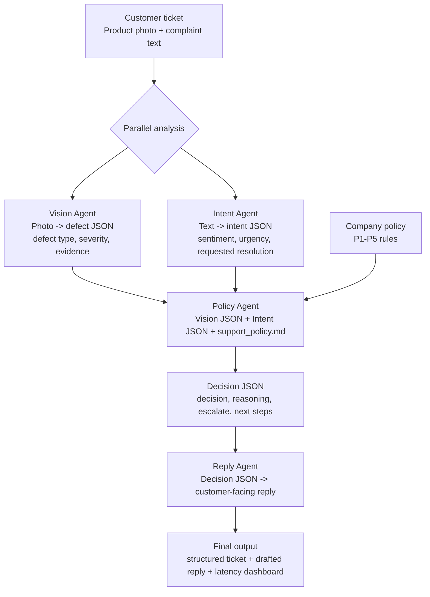

# ClaimLens Triage

ClaimLens Triage is a multimodal customer support triage app powered by Gemma 4. It combines a product photo with a customer's complaint, runs a four-agent workflow, applies a small company policy, and produces a structured ticket plus a customer-ready reply.

The app is designed for hackathon demos where agent collaboration needs to be visible: each agent has a distinct role, explicit JSON handoffs, and measurable latency.

## What It Does

A customer submits:

- One product photo, such as a cracked radio, damaged mug, torn headphones, or intact item.
- One text complaint describing what happened and what resolution they want.

ClaimLens Triage returns:

- Vision JSON describing physical evidence.
- Intent JSON describing customer sentiment, urgency, and requested resolution.
- Policy JSON with the decision, reasoning, escalation flag, and policy references.
- A concise customer-facing reply.
- A latency dashboard for each agent and total wall-clock time.

## Architecture



Vision and Intent run in parallel because they do not depend on each other. Policy waits for both JSON handoffs, then Reply converts the final decision into customer-facing language.

## Agent Roles

| Agent | Input | Output | Purpose |
| --- | --- | --- | --- |
| Vision Agent | Product photo | Defect JSON | Reads visual evidence and estimates defect severity |
| Intent Agent | Complaint text | Intent JSON | Extracts sentiment, urgency, and requested resolution |
| Policy Agent | Vision JSON, Intent JSON, policy doc | Decision JSON | Applies company rules and decides refund, replacement, denial, or escalation |
| Reply Agent | Decision JSON | Customer reply | Drafts a short, empathetic support response |

## Provider Support

The project supports two Gemma 4 providers:

| Provider | Model | Environment variable |
| --- | --- | --- |
| Cerebras | `gemma-4-31b` | `CEREBRAS_API_KEY` |
| Gemini | `gemma-4-31b-it` | `GEMINI_API_KEY` |

The Gradio UI includes a provider selector. The CLI uses Cerebras by default and can switch to Gemini with `--provider gemini`.

## Setup

```powershell
python -m venv .venv
.\.venv\Scripts\Activate.ps1
pip install -r requirements.txt
```

Create or reuse `.env` with one or both provider keys:

```text
CEREBRAS_API_KEY=your_cerebras_api_key_here
GEMINI_API_KEY=your_gemini_api_key_here
```

## Run The Gradio App

```powershell
python -m triage_agent.gradio_app --port 7861
```

Open the local URL:

```text
http://127.0.0.1:7861/
```


## Example Tickets

The Gradio intake panel includes generated sample tickets for both good and defective products:

- Radio with cracked casing.
- Headphones in good condition.
- Headphones with a torn cushion and cracked band.
- Mug in good condition.
- Mug with a chipped rim and hairline crack.
- Smartwatch in good condition.
- Smartwatch with a cracked screen.

Example images live in [examples/images](D:/gemma_hackathon/examples/images).

## Company Policy

The Policy Agent uses [policy/support_policy.md](D:/gemma_hackathon/policy/support_policy.md).

The current rules cover:

- **P1 Product damage on arrival:** approve refund or replacement when visible moderate or severe damage supports the request.
- **P2 Minor cosmetic defects:** avoid automatic full refunds for usable products with minor cosmetic wear.
- **P3 No visible defect:** deny automated refund or replacement when evidence is missing or weak.
- **P4 Safety and escalation:** escalate safety, legal, fraud, repeated failure, or mismatched-evidence cases.
- **P5 Urgency:** urgency alone does not override evidence, but urgent safety or severe-damage cases should escalate.

## Output Shape

The final artifact is a JSON ticket with four agent outputs and a latency dashboard:

```json
{
  "structured_ticket": {
    "vision": {},
    "intent": {},
    "policy": {},
    "reply": "Customer-facing response"
  },
  "latency_dashboard": {
    "vision_ms": 0,
    "intent_ms": 0,
    "policy_ms": 0,
    "reply_ms": 0,
    "total_wall_clock_ms": 0
  }
}
```

## Project Structure

```text
triage_agent/
  agents.py          Four specialized agents
  orchestrator.py    Parallel and sequential pipeline execution
  llm.py             Cerebras and Gemini provider clients
  gradio_app.py      ClaimLens Triage UI
  example_cases.py   Generated sample ticket metadata
  schemas.py         Shared result shapes
policy/
  support_policy.md  Company support rules
examples/
  complaints/        Text complaint examples
  images/            Generated product examples
tests/               Unit tests for parsing, pipeline wiring, UI helpers
```

## Tests

```powershell
python -B -m unittest discover -s tests
```

## Why This Is Agentic

ClaimLens Triage is not a single hidden prompt. It exposes a collaborative workflow:

- Separate agents own separate responsibilities.
- Vision and Intent run independently in parallel.
- Policy receives explicit JSON handoffs from both upstream agents.
- Reply depends only on the policy decision.
- The final UI shows handoffs, policy reasoning, and latency so the orchestration is inspectable.
